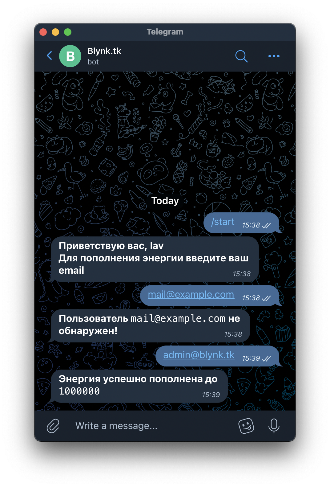

# Blynk Bot - a bot to update user amount of "Blynk Energy" by mail
# Usage example:

# BlynkBot/config.ini example:
``` ini
[bot]
bot_username = bot username
bot_token = bot token
mongo_url = mongo url
[blynk]
blynk_url = blynk admin url
admin_email = blynk admin mail
admin_password = blynk admin password
energy = energy amount
```
